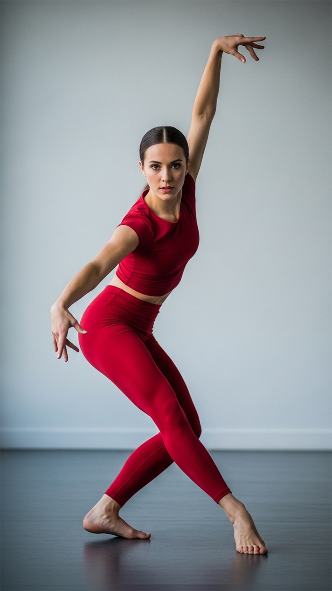
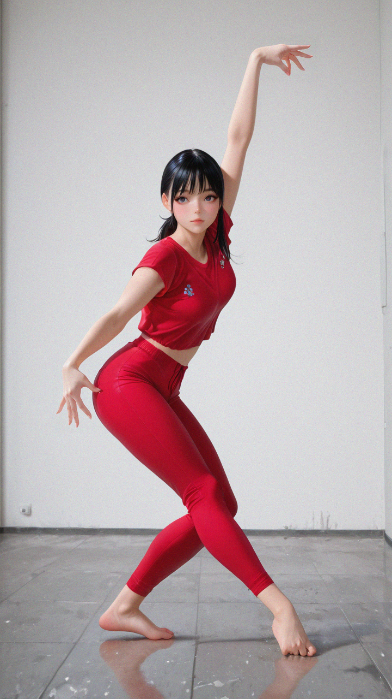
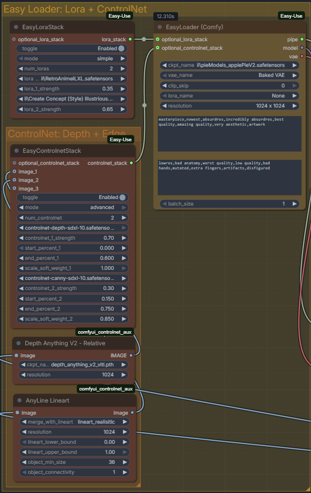
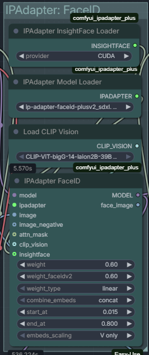
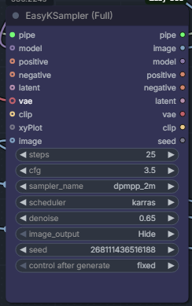
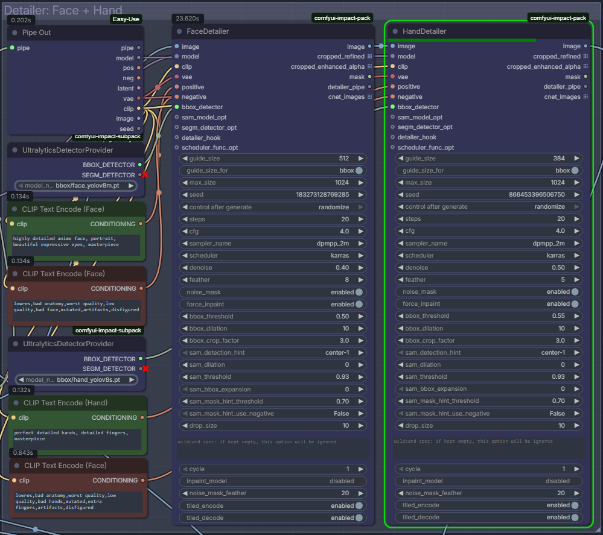
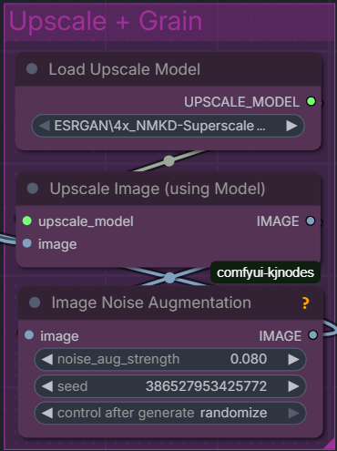
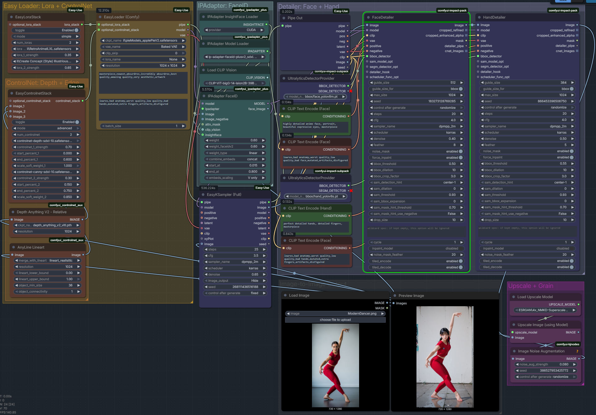

# Local AI Stylization & Anatomical Correction Pipeline
### A High-Fidelity Image-to-Image ComfyUI Workflow for Portrait & Character Art

Welcome to my custom ComfyUI workflow repository! This project hosts a production-grade Image-to-Image (img2img) stylization pipeline that I developed locally. The workflow transforms any photographic portrait or character pose into a highly stylized, high-fidelity aesthetic (such as modern retro anime) while perfectly retaining the subject's **original composition, clothing folds, and facial identity**. 

To bypass the typical "AI artifacts" of distorted hands and warped faces, the pipeline incorporates an automated, localized YOLO-based object detection and inpainting pass, finished with physical-emulsion style grain to achieve an organic, professional-grade aesthetic.

🎨 **Portfolio Website:** [ayushchinmay.myportfolio.com](https://ayushchinmay.myportfolio.com/)  
👾 **Workflow Download:** [Grab the JSON Workflow File](./workflow.json)

---

## Workflow Architecture Overview

The core philosophy of this workflow is **guided constraint**. Standard image-to-image translation often suffers from a trade-off: denoise too low, and the image doesn't stylize; denoise too high, and you lose the pose, the clothing details, and the subject's face. 

This pipeline solves that problem by using a multi-layered guidance system operating across different spatial and conceptual domains:

```
[Input Image] 
   │
   ├─► [Depth Anything V2] ──► [ControlNet Stack] ┐
   ├─► [AnyLine Lineart] ────► [ControlNet Stack] ├─► [EasyKSampler (Base)]
   ├─► [IP-Adapter FaceID] ───────────────────────┤          │
   └─► [Latent Image (Denoise 0.65)] ─────────────┘          ▼
                                                      [Raw Stylized Image]
                                                             │
   ┌─────────────────────────────────────────────────────────┘
   ▼
[YOLO Detector (Face/Hand)] ──► [Face/Hand Detailers] ──► [Upscale & Grain] ──► [Final Output]
```

1. **Compositional Guidance (Depth & Lineart):** *Depth Anything V2* establishes the structural boundaries and 3D volume, while *AnyLine Lineart* captures fine details (wrinkles, boundaries, hair strands).
2. **Identity Injection (IP-Adapter FaceID):** Extracts the facial embedding of the original subject and injects it directly into the cross-attention layers of the model, allowing zero-shot likeness replication.
3. **Primary Diffusion (EasyKSampler):** Translates the stylized features using a high-quality SDXL base model.
4. **Anatomical Correction (Impact Pack):** Automatically detects faces and hands using Ultralytics YOLO models, cropping and re-sampling those specific regions at higher resolutions to fix anatomical errors.
5. **Photographic Finishing (KJNodes):** Upscales the image and applies an organic analog grain overlay to eliminate synthetic banding, tie the composite together, and make it look shot on physical film.

---

## Showcase: Before & After Example

Here is an example execution of the pipeline converting an input composition reference into a fully stylized illustration:

| Input Subject Reference | Final Pipeline Output |
| :---: | :---: |
|  |  |

### Prompt Engineering Configuration
* **Positive Prompt (EasyLoader):**
  > `highly detailed anime face, portrait, beautiful expressive eyes, masterpiece, dynamic dancing pose, white athletic wear`
* **Negative Prompt (EasyLoader):**
  > `lowres, bad anatomy, worst quality, low quality, bad face, mutated, extra fingers, disfigured, blurry`

---

## The Mathematics of Image-to-Image & Control Guidance

In standard text-to-image (txt2img), generation starts with pure Gaussian noise $$z_T \sim \mathcal{N}(0, I)$$ and iteratively denoises it over $T$ steps. In image-to-image (img2img), we begin by encoding our source image $x$ into the latent space using a Variational Autoencoder (VAE) encoder, yielding $z_0 = 	ext{VAEEncode}(x)$.

We then inject noise up to an intermediate step $t_{start}$ dictated by the **denoise strength** $d \in [0, 1]$. Let $N_{total}$ be the total steps configured. The actual executed sampling steps $N_{exec}$ are calculated as:
$$N_{exec} = \lfloor N_{total} 	imes d 
floor$$
During these executed steps, the model predicts the noise $\epsilon_	heta$ at each step $t$. Our workflow modifies this noise prediction by applying simultaneous conditioning inputs: text prompts ($c_{text}$), structural control signals ($c_{control}$), and facial image embeddings ($E_{img}$). This combined cross-attention mechanism can be abstractly represented as:
$$	ilde{\epsilon}_	heta(z_t, c_{text}, c_{control}, E_{img}) = \epsilon_	heta(z_t, c_{text} + w_{ip}E_{img}) + w_{control}	ext{ControlNet}(z_t, c_{control})$$
where:
* $w_{ip}$ is the conditioning weight of the IP-Adapter FaceID.
* $w_{control}$ is the cumulative weight of our dual ControlNet stack (Depth + Lineart).

This formulation ensures that the final latent vector is heavily guided by both the spatial structure of the original image and the visual characteristics of the target face, preventing the diffusion process from drifting away from the source content.

---

## Hardware Specifications

This workflow was built, optimized, and tested entirely on my local workstation:

| Component | Specification |
| :--- | :--- |
| **CPU** | Intel Core i7-10700K (10th Gen, 8 Cores / 16 Threads) |
| **GPU** | NVIDIA GeForce RTX 2080Ti (11GB GDDR6 VRAM) |
| **RAM** | 64GB DDR4 Dual-Channel |

*Development Note:* 11GB of VRAM is an excellent sweet spot for local SDXL execution. By utilizing ComfyUI's native memory management alongside efficient custom nodes, this pipeline generates fully upscaled, detailed images without hitting Out-Of-Memory (OOM) boundaries.

---

## Installation & Setup Guide

### 1. Install ComfyUI-Portable
To easily manage dependencies, Python environments, and updates, use the ComfyUI Easy-Install package:
1. Clone or download the installer from the [Tavris1 ComfyUI Easy Install repository](https://github.com/Tavris1/ComfyUI-Easy-Install).
2. Run the installer script to automatically configure a sandboxed Python environment with CUDA support.

### 2. Install Required Custom Nodes
Open ComfyUI, click on the **Manager** button on the side panel, select **Custom Nodes Manager**, and install the following packages:

* **ComfyUI-Easy-Use** (by `yolain`): Simplifies loader setups, KSamplers, and provides streamlined pipeline stacks.
* **ComfyUI-Impact-Pack** & **ComfyUI-Impact-Subpack** (by `ltdrdata`): Powering the automatic YOLO face/hand detection and localized inpainting detailers.
* **comfyui_controlnet_aux** (by `fannovel16`): Contains the preprocessors for *Depth Anything V2* and *AnyLine Lineart*.
* **ComfyUI-IP-Adapter-Plus** (by `cubiq`): Required to load CLIP Vision models and run face/style injection.
* **ComfyUI-KJNodes** (by `kijai`): Provides utility nodes, including the essential *Image Noise Augmentation* node for adding realistic grain.

### 3. Model Download Checklist
Download the following models and place them in their respective ComfyUI directory folders. You can also use the **Model Manager** inside ComfyUI to search and install most of these:

#### Checkpoints & LoRAs
* **Base Checkpoint:** [Flatbread-il (SDXL Base)](https://civitai.com/models/1769000/flatbread-il)  
  👉 *Path:* `ComfyUI/models/checkpoints/`
* **Stylizing LoRA:** Use any style LoRA of choice (e.g., modern retro anime aesthetics).  
  👉 *Path:* `ComfyUI/models/loras/`

#### ControlNets & Adapters
* **ControlNet Depth:** `controlnet-depth-sdxl-1.0.safetensors`  
  👉 *Path:* `ComfyUI/models/controlnet/`
* **ControlNet Lineart:** `controlnet-canny-sdxl-1.0.safetensors` (or dedicated Lineart/Anyline models)  
  👉 *Path:* `ComfyUI/models/controlnet/`
* **IP-Adapter Model:** `ip-adapter-faceid-plusv2_sdxl.bin`  
  👉 *Path:* `ComfyUI/models/ipadapter/`
* **CLIP Vision Encoder:** `CLIP-ViT-bigG-14-laion2B-39B.safetensors`  
  👉 *Path:* `ComfyUI/models/clip_vision/`

#### Detectors & Upscalers
* **YOLO Models:** `bbox/face_yolov8m.pt` and `bbox/hand_yolov8s.pt`  
  👉 *Path:* `ComfyUI/models/ultralytics/bbox/`
* **Upscale Model:** `4x_NMKD-Superscale.pth`  
  👉 *Path:* `ComfyUI/models/upscale_models/`

> 💡 **Crucial Step for IP-Adapter FaceID:** FaceID requires the `insightface` Python library. If you encounter errors, open your terminal in your ComfyUI directory and run:
> ```bash
> .\python_embeded\python.exe -m pip install insightface
> ```
> *If you are on Windows and compilation fails, download the precompiled `.whl` wheel file matching your Python version from GitHub and install it directly.*

---

## Detailed Node Walkthrough & Settings

### Section 1: Loader Section & ControlNet Stack
This initial stage acts as the programmatic spine of the generation loop. It loads the base structural checkpoint, chains the custom aesthetic style LoRAs, and processes the reference image into structural control signals. 

The **EasyLoader** coordinates the checkpoints and prompt strings, passing a unified pipe to the conditioning system. Meanwhile, the input image branches down into two auxiliary preprocessors: **Depth Anything V2** parses the frame into a spatial gradient mapping physical volume and relative distance, while **AnyLine Lineart** extracts high-frequency contours like edge wrinkles and clothing lines. 

These maps pass to the **EasyControlnetStack**, which wraps them into a consolidated spatial constraint block. By embedding these strict geometric bounds directly into the diffusion calculation, the pipeline forces the generative model to paint strictly inside the lines and depth volumes of your input image, ensuring zero composition drift.



| Node | Parameter | Setting | Rationale |
| :--- | :--- | :--- | :--- |
| **Depth Anything V2 - Relative** | resolution | `1024` | Matches the native resolution of SDXL for perfect pixel alignment. |
| **AnyLine Lineart** | merge_with_lineart | `lineart_realistic` | Combines robust edge lines with softer contours to preserve clothing folds. |
| **EasyControlnetStack** | controlnet_1_strength | `0.70` | (Depth Anything) High enough to secure 3D pose volume without bloating shapes. |
| | controlnet_2_strength | `0.30` | (AnyLine) Lower strength to guide fine wrinkles without introducing hard, jagged outlines. |

---

### Section 2: IPAdapter: FaceID
While the ControlNets lock down the physical layout, the IP-Adapter module injects target identity features. 

The **IPAdapter InsightFace Loader** initializes a local face recognition network via CUDA to compute facial feature descriptors from the input picture. The **Load CLIP Vision** node then translates the visual data into deep semantic vectors, which are combined inside the **IPAdapter FaceID** unit. 

Instead of translating an identity via simple text words (which the model frequently misinterprets), this module updates the underlying cross-attention projection maps of the neural network directly. It forces the output face to adopt the specific facial coordinates, eye placements, and look of the original subject without relying on heavy text prompt instructions.



| Node | Parameter | Setting | Rationale |
| :--- | :--- | :--- | :--- |
| **IPAdapter FaceID** | weight | `0.60` | Balances likeness retention with the style of the checkpoint. |
| | weight_faceidv2 | `0.60` | Stronger weight ensures correct facial feature placement. |
| | weight_type | `linear` | Standard, stable scaling mode. |
| | start_at | `0.015` | Starts early in the process to assert identity before structures harden. |
| | end_at | `0.800` | Stops before the final steps to let the base model clean up micro-details. |

---

### Section 3: EasyKSampler (Full)
This is the core execution matrix where structural maps, style parameters, identity configurations, and noise come together to run the actual image diffusion process. 

The **EasyKSampler** takes the raw visual data, passes it through a VAE encoder to reduce dimensionality into a packed latent block, and then introduces a controlled volume of random Gaussian noise calculated from your **denoise strength** factor ($0.65$). Over an iterative step sequence, the sampler evaluates the joint mathematical conditionings: the prompt instructions, the ControlNet structures, and the IP-Adapter face maps. 

At a denoise value of $0.65$, the system strips away exactly enough underlying data to completely re-render the aesthetic texture into the target anime medium, while retaining the base structural positions.



| Parameter | Value | Rationale / Recommendation |
| :--- | :--- | :--- |
| **steps** | `25` | Ideal step count for convergence using Euler/DPM++ samplers. |
| **cfg** | `3.5` | Lower CFG allows the style LoRA and IP-Adapter to blend naturally without burning. |
| **sampler_name** | `dpmpp_2m` | High stability and fast convergence for SDXL. |
| **scheduler** | `karras` | Smoothens step distribution, yielding cleaner gradients. |
| **denoise** | `0.65` | The sweet spot for img2img: alters the artistic medium while maintaining core composition. |

---

### Section 4: Detailer (Face + Hand)
Base latent generations frequently break when painting complex micro-structures like hands and facial expressions because those tiny areas occupy only a small fraction of the global generation matrix. To solve this, the **Detailer** loop executes localized micro-inpainting passes. 

The **UltralyticsDetectorProvider** loads independent YOLOv8 models optimized specifically for box detection (`face_yolov8m` and `hand_yolov8s`). These models scan the output matrix, trace high-accuracy boundaries directly over the distorted features, and pass the coordinate boxes to the **FaceDetailer** and **HandDetailer** nodes. 

The system crops these isolated regions out, blows them up to clear, high-resolution canvas blocks, and runs an independent mini-diffusion pass over them. Using specialized text conditioning (`"highly detailed anime face"`, `"perfect detailed hands"`), it re-draws the malformed features with correct anatomy before down-sampling and stitching them cleanly back into the master image.



| Node | Parameter | Setting | Rationale |
| :--- | :--- | :--- | :--- |
| **FaceDetailer** | guide_size | `512` | Crops and resizes the detected face region to 512x512 before inpainting. |
| | denoise | `0.40` | Low denoise avoids altering the face shape; purely repairs artifacts. |
| | bbox_dilation | `10` | Expands the boundary by 10 pixels to ensure seamless blending at the neck/hairlines. |
| **HandDetailer** | guide_size | `384` | Resizes hand crops to 384x384. |
| | denoise | `0.50` | Slightly higher denoise allows the model to structurally redraw broken fingers. |

---

### Section 5: Upscale + Grain
The final stage upgrades the raw canvas to display resolutions and cleans up digital artifacting. 

The image passes to **Upscale Image (using Model)**, which runs neural interpolation via the **4x_NMKD-Superscale** engine to increase pixel density without introducing standard bicubic blurring or washing out hand-drawn lines. 

Because neural upscalers and diffusion models leave smooth digital signatures, synthetic bands, and perfectly sterile color transitions, the output passes into the **Image Noise Augmentation** node. This unit overlays a fine, high-frequency mathematical film-grain noise. This grain performs an optical dithering effect that visually masks AI smoothing, dissolves micro-banding artifacts, and injects a raw, filmic texture that makes the final piece feel look and feel hand-rendered.



| Node | Parameter | Setting | Rationale |
| :--- | :--- | :--- | :--- |
| **Upscale (using Model)** | upscale_model | `4x_NMKD-Superscale` | Superior upscaler for keeping anime artwork clean and sharp. |
| **Image Noise Augmentation**| noise_aug_strength| `0.080` | Adds a subtle, high-frequency grain overlay. It acts as an optical dither to remove digital banding and mask artificial smoothing. |

---

## Complete Workspace Map

Below is the layout map of the engineered ComfyUI interface workspace:



---

## Technical Reflections & Lessons Learned

Developing this workflow was an incredible journey into the mechanics of local generative AI. Here are my main takeaways from engineering this pipeline:

1. **Prompting is Only 10% of the Equation:** Relying purely on text prompts to convert styles yields unpredictable results. True creative control comes from spatial control variables (ControlNets) and feature injection (IP-Adapter).
2. **Local Hardware Optimization:** Running heavy pipelines on an 11GB RTX 2080Ti taught me the value of efficient nodes. Combining pipelines using custom packages like `ComfyUI-Easy-Use` reduces the overall latent memory overhead significantly compared to modular vanilla implementations.
3. **The Importance of Post-Processing:** Raw AI generations are often too clean, giving them a sterile, plastic feel. Adding custom upscaling followed by physical grain injection single-handedly elevates the work from a "cheap AI generation" to a piece of professional digital illustration that looks hand-rendered.

Feel free to download the [workflow JSON file](./workflow.json), load it into your ComfyUI canvas, and try it out with your own portraits! If you have any questions or feedback, reach out via my portfolio.
