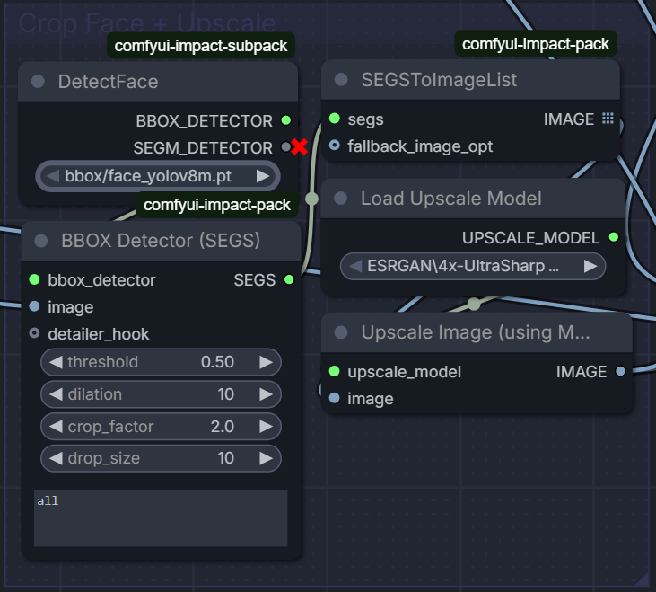
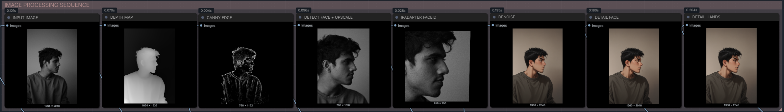

# Local AI Stylization & Anatomical Correction Pipeline
### A High-Fidelity Image-to-Image ComfyUI Workflow for Portrait & Character Art

Welcome to my custom ComfyUI workflow repository! This project hosts a production-grade Image-to-Image (img2img) stylization pipeline that I developed locally. The workflow transforms any photographic portrait or character pose into a highly stylized, high-fidelity aesthetic (such as modern retro anime) while perfectly retaining the subject's **original composition, clothing folds, and facial identity**. 

To bypass the typical "AI artifacts" of distorted hands and warped faces, the pipeline incorporates an automated, localized YOLO-based object detection and inpainting pass, finished with physical-emulsion style grain to achieve an organic, professional-grade aesthetic.

🎨 **Portfolio Website:** [ayushchinmay.myportfolio.com](https://ayushchinmay.myportfolio.com/)  
👾 **Workflow Download:** [Grab the JSON Workflow File](./workflow.json)

---

## Showcase: Before & After Example

Here is an example execution of the pipeline converting an input composition reference into a fully stylized illustration:

| Input Subject Reference | Final Pipeline Output |
| :---: | :---: |
|  |  |

### Prompt Engineering Configuration
* **Positive Prompt (EasyLoader):**
  > `masterpiece, newest, absurdres, incredibly absurdres, best quality, amazing quality, very aesthetic, highly detailed anime style, vibrant cel shading, expressive eyes, crisp lineart, colorful aesthetic`
* **Negative Prompt (EasyLoader):**
  > `lowres, bad anatomy, worst quality, low quality, normal quality, bad hands, mutated, extra fingers, artifacts, disfigured, photorealistic, hyperrealistic, 3d render, real life, text, error, blurry`

---

## Workflow Architecture Overview

The core philosophy of this workflow is **guided constraint**. Standard image-to-image translation often suffers from a trade-off: denoise too low, and the image doesn't stylize; denoise too high, and you lose the pose, the clothing details, and the subject's face. 

This pipeline solves that problem by using a multi-layered guidance system operating across different spatial and conceptual domains, supplemented by an automated **Pre-Attention Face Isolation** stage that maximizes identity accuracy while leaving the checkpoint model unconstrained.

Below is the complete layout map of the engineered ComfyUI interface workspace showing the entire node architecture:


1. **Compositional Guidance (Depth & Lineart):** *Depth Anything V2* establishes the structural boundaries and 3D volume, while *AnyLine Lineart* captures fine details (wrinkles, boundaries, hair strands).
2. **Pre-Attention Face Isolation & Upscaling:** Rather than feeding the full, uncropped canvas to the identity network, a dedicated YOLO node isolates the face bounding box and upscales it dynamically via *4x-UltraSharp*. This delivers an ultra-clean, high-frequency crop directly to the encoder.
3. **Identity Injection (IP-Adapter FaceID):** Extracts the facial embedding of the isolated high-res face tile and injects it directly into the cross-attention layers of the model, allowing zero-shot likeness replication without letting background or clothing elements contaminate the style.
4. **Primary Diffusion (EasyKSampler):** Translates the stylized features using a high-quality SDXL base model.
5. **Anatomical Correction (Impact Pack):** Automatically detects faces and hands using Ultralytics YOLO models, cropping and re-sampling those specific regions at higher resolutions to fix anatomical errors.
6. **Photographic Finishing (KJNodes):** Upscales the final composite image and applies an organic analog grain overlay to eliminate synthetic banding, mask artificial smoothing, and tie the output together.
7. **Visual Diagnostic Sequence:** A multi-stage preview block branches out from every critical junction in the pipeline, outputting a real-time visual timeline of the execution from raw input to finished grain.

---

## The Mathematics of Image-to-Image & Control Guidance

In standard text-to-image (txt2img), generation starts with pure Gaussian noise 
$$z_T \sim \mathcal{N}(0, I)$$
and iteratively denoises it over $T$ steps. In image-to-image (img2img), we begin by encoding our source image $x$ into the latent space using a Variational Autoencoder (VAE) encoder, yielding 
$$z_0 = 	ext{VAEEncode}(x)$$

We then inject noise up to an intermediate step $t_{	ext{start}}$ dictated by the **denoise strength** $d \in [0,1]$. Let $N_{	ext{total}}$ be the total steps configured. The actual executed sampling steps $N_{	ext{exec}}$ are calculated as:
$$N_{	ext{exec}} = \lfloor N_{	ext{total}} 	imes d 
floor$$

During these executed steps, the model predicts the noise $\epsilon_	heta$ at each step $t$. Our workflow modifies this noise prediction by applying simultaneous conditioning inputs: text prompts ($c_{	ext{text}}$), structural control signals ($c_{	ext{control}}$), and facial image embeddings ($E_{	ext{img}}$). This combined cross-attention mechanism can be abstractly represented as:
$$	ilde{\epsilon}_	heta(z_t, c_{	ext{text}}, c_{	ext{control}}, E_{	ext{img}}) = \epsilon_	heta(z_t, c_{	ext{text}} + w_{	ext{ip}}E_{	ext{img}}) + w_{	ext{control}}	ext{ControlNet}(z_t, c_{	ext{control}})$$

where:
* $w_{	ext{ip}}$ is the conditioning weight of the IP-Adapter FaceID.
* $w_{	ext{control}}$ is the cumulative weight of our dual ControlNet stack (Depth + Lineart).

By limiting the facial embedding matrix $E_{	ext{img}}$ to a targeted, upscaled segment of the face ($x_{	ext{face}}$) rather than the entire canvas ($x$), we prevent the cross-attention layers from introducing unwanted compositional bias or clothing textures from the original reference image into the wider latent spaces of $z_t$.

---

## Hardware Specifications

This workflow was built, optimized, and tested entirely on my local workstation:

| Component | Specification |
| :--- | :--- |
| **CPU** | Intel Core i7-10700K (10th Gen, 8 Cores / 16 Threads) |
| **GPU** | NVIDIA GeForce RTX 2080Ti (11GB GDDR6 VRAM) |
| **RAM** | 64GB DDR4 Dual-Channel |

*Development Note:* 11GB of VRAM is an excellent sweet spot for local SDXL execution. By utilizing ComfyUI's native memory management alongside efficient custom nodes, this pipeline generates fully upscaled, detailed images without hitting Out-Of-Memory (OOM) boundaries.

---

## Installation & Setup Guide

### 1. Install ComfyUI-Portable
To easily manage dependencies, Python environments, and updates, use the ComfyUI Easy-Install package:
1. Clone or download the installer from the [Tavris1 ComfyUI Easy Install repository](https://github.com/Tavris1/ComfyUI-Easy-Install).
2. Run the installer script to automatically configure a sandboxed Python environment with CUDA support.

### 2. Install Required Custom Nodes
Open ComfyUI, click on the **Manager** button on the side panel, select **Custom Nodes Manager**, and install the following packages:

* **ComfyUI-Easy-Use** (by `yolain`): Simplifies loader setups, KSamplers, and provides streamlined pipeline stacks.
* **ComfyUI-Impact-Pack** & **ComfyUI-Impact-Subpack** (by `ltdrdata`): Powering the automatic YOLO face/hand detection, face isolation, and localized inpainting detailers.
* **comfyui_controlnet_aux** (by `fannovel16`): Contains the preprocessors for *Depth Anything V2* and *AnyLine Lineart*.
* **ComfyUI-IP-Adapter-Plus** (by `cubiq`): Required to load CLIP Vision models and run face/style injection.
* **ComfyUI-KJNodes** (by `kijai`): Provides utility nodes, including the essential *Image Noise Augmentation* node for adding realistic grain.

### 3. Model Download Checklist
Download the following models and place them in their respective ComfyUI directory folders. You can also use the **Model Manager** inside ComfyUI to search and install most of these:

#### Checkpoints & LoRAs
* **Base Checkpoint:** [Flatbread-il (SDXL Base)](https://civitai.com/models/1769000/flatbread-il)  
  👉 *Path:* `ComfyUI/models/checkpoints/`
* **Stylizing LoRA:** Use any style LoRA of choice (e.g., modern retro anime aesthetics).  
  👉 *Path:* `ComfyUI/models/loras/`

#### ControlNets & Adapters
* **ControlNet Depth:** `controlnet-depth-sdxl-1.0.safetensors`  
  👉 *Path:* `ComfyUI/models/controlnet/`
* **ControlNet Lineart:** `controlnet-canny-sdxl-1.0.safetensors` (or dedicated Lineart/Anyline models)  
  👉 *Path:* `ComfyUI/models/controlnet/`
* **IP-Adapter Model:** `ip-adapter-faceid-plusv2_sdxl.bin`  
  👉 *Path:* `ComfyUI/models/ipadapter/`
* **CLIP Vision Encoder:** `CLIP-ViT-bigG-14-laion2B-39B.safetensors`  
  👉 *Path:* `ComfyUI/models/clip_vision/`

#### Detectors & Upscalers
* **YOLO Models:** `bbox/face_yolov8m.pt` and `bbox/hand_yolov8s.pt`  
  👉 *Path:* `ComfyUI/models/ultralytics/bbox/`
* **Upscale Models:** `4x_NMKD-Superscale.pth` and `4x-UltraSharp.pth`  
  👉 *Path:* `ComfyUI/models/upscale_models/`

> 💡 **Crucial Step for IP-Adapter FaceID:** FaceID requires the `insightface` Python library. If you encounter errors, open your terminal in your ComfyUI directory and run:
> ```bash
> .\python_embeded\python.exe -m pip install insightface
> ```
> *If you are on Windows and compilation fails, download the precompiled `.whl` wheel file matching your Python version from GitHub and install it directly.*

---

## Detailed Node Walkthrough & Settings

### Section 1: Loader Section & ControlNet Stack
This initial stage acts as the programmatic spine of the generation loop. It loads the base structural checkpoint, chains the custom aesthetic style LoRAs, and processes the reference image into structural control signals. 

The **EasyLoader** coordinates the checkpoints and prompt strings, passing a unified pipe to the conditioning system. Meanwhile, the input image branches down into two auxiliary preprocessors: **Depth Anything V2** parses the frame into a spatial gradient mapping physical volume and relative distance, while **AnyLine Lineart** extracts high-frequency contours like edge wrinkles and clothing lines. 

These maps pass to the **EasyControlnetStack**, which wraps them into a consolidated spatial constraint block. By embedding these strict geometric bounds directly into the diffusion calculation, the pipeline forces the generative model to paint strictly inside the lines and depth volumes of your input image, ensuring zero composition drift.


| Node | Parameter | Setting | Rationale |
| :--- | :--- | :--- | :--- |
| **Depth Anything V2 - Relative** | resolution | `1024` | Matches the native resolution of SDXL for perfect pixel alignment. |
| **AnyLine Lineart** | merge_with_lineart | `lineart_realistic` | Combines robust edge lines with softer contours to preserve clothing folds. |
| **EasyControlnetStack** | controlnet_1_strength | `0.65` | (Depth Anything) Secure 3D pose volume without bloating shapes. |
| | controlnet_2_strength | `0.35` | (AnyLine) Lower strength to guide fine wrinkles without introducing hard outlines. |

---

### Section 2: Pre-Attention Face Detection & Upscaling
Standard IP-Adapter pipelines ingest the full source image, causing the cross-attention network to absorb surrounding background details, lighting conditions, and clothing textures into the facial identity conditioning vector. This heavily limits the checkpoint model's creative freedom when rendering the stylized scene.

To circumvent this limitation, this workflow incorporates an automated **Crop Face + Upscale** routing group. An independent **UltralyticsDetectorProvider** loads a specialized face detection framework (`face_yolov8m.pt`) to map facial bounding coordinates on the input photo. The **BboxDetectorSEGS** node clips out this region, applying a generous padding factor of `1.8` to ensure hair parameters and head geometry are captured. 

This low-res tile is passed to **ImageUpscaleWithModel**, powered by the ultra-clear **4x-UltraSharp** model, upscaling the isolated face into a sharp, high-resolution tile. This automated cleaning sequence guarantees that the downstream identity network receives clean, high-density facial descriptors completely decoupled from background clutter.



| Node | Parameter | Setting | Rationale |
| :--- | :--- | :--- | :--- |
| **UltralyticsDetectorProvider** | model_name | `bbox/face_yolov8m.pt` | Multi-pass face detection model optimized for varying angles and profiles. |
| **BboxDetectorSEGS** | threshold | `0.50` | Filters out false positives while ensuring reliable acquisition. |
| | crop_factor | `1.8` | Expands boundaries around the face to preserve hair context and skull structure. |
| **ImageUpscaleWithModel** | upscale_model | `4x-UltraSharp.pth` | Reconstructs micro-level clarity on the face tile, maximizing CLIP Vision reading accuracy. |

---

### Section 3: IPAdapter: FaceID
With the spatial parameters secured by the ControlNets and the isolated face crop prepared, the IP-Adapter module maps the target facial identity features.

The **IPAdapter InsightFace Loader** initializes a face recognition network via CUDA to extract high-dimensional facial descriptors from our upscaled tile. The **Load CLIP Vision** encoder maps these features into deep semantic vectors, combining them inside the **IPAdapter FaceID** node. 

Instead of translating identity via text tokens (which the model frequently warps or dilutes), this configuration injects identity maps directly into the cross-attention projection fields of the base checkpoint. Because the face vector was perfectly isolated in the previous step, the system forces the output face to replicate the exact facial landmarks, eye contours, and expressions of the source subject, while granting the base checkpoint total freedom to stylize the hair, clothing, and background environment.


| Node | Parameter | Setting | Rationale |
| :--- | :--- | :--- | :--- |
| **IPAdapter FaceID** | weight | `0.65` | Dictates absolute identity strength. Balances likeness accuracy with base style aesthetics. |
| | weight_faceidv2 | `0.65` | Employs FaceID-v2 optimization layers to lock structural proportions. |
| | weight_type | `linear` | Maintains standard, predictable feature blending. |
| | start_at | `0.01` | Asserts identity instantly at the beginning of the diffusion cycle. |
| | end_at | `0.85` | Cuts out in the final steps, letting the checkpoint finish skin blending naturally. |

---

### Section 4: EasyKSampler (Full)
This is the core execution matrix where structural maps, style parameters, identity configurations, and noise come together to run the actual image diffusion process. 

The **EasyKSampler** takes the raw visual data, passes it through a VAE encoder to reduce dimensionality into a packed latent block, and then introduces a controlled volume of random Gaussian noise calculated from your **denoise strength** factor ($0.65$). Over an iterative step sequence, the sampler evaluates the joint mathematical conditionings: the prompt instructions, the ControlNet structures, and the IP-Adapter face maps. 

At a denoise value of $0.65$, the system strips away exactly enough underlying data to completely re-render the artistic texture into the target anime medium, while retaining the base structural positions.


| Parameter | Value | Rationale / Recommendation |
| :--- | :--- | :--- |
| **steps** | `25` | Ideal step count for convergence using Euler/DPM++ samplers. |
| **cfg** | `4.0` | Balanced guidance; prevents over-saturation and prompt-burning while obeying prompts. |
| **sampler_name** | `dpmpp_2m` | High stability and fast convergence for SDXL. |
| **scheduler** | `karras` | Smoothens step distribution, yielding cleaner gradients. |
| **denoise** | `0.65` | The sweet spot for img2img: alters the artistic medium while maintaining core composition. |

---

### Section 5: Detailer (Face + Hand)
Base latent generations frequently break when painting complex micro-structures like hands and facial expressions because those tiny areas occupy only a small fraction of the global generation matrix. To solve this, the **Detailer** loop executes localized micro-inpainting passes. 

The **UltralyticsDetectorProvider** loads independent YOLOv8 models optimized specifically for box detection (`face_yolov8m` and `hand_yolov8s`). These models scan the output matrix, trace high-accuracy boundaries directly over the distorted features, and pass the coordinate boxes to the **FaceDetailer** and **HandDetailer** nodes. 

The system crops these isolated regions out, blows them up to clear, high-resolution canvas blocks, and runs an independent mini-diffusion pass over them. Using specialized text conditioning (`"perfect highly detailed anime face"`, `"perfect anime hands"`), it re-draws the malformed features with correct anatomy before down-sampling and stitching them cleanly back into the master image.


| Node | Parameter | Setting | Rationale |
| :--- | :--- | :--- | :--- |
| **FaceDetailer** | guide_size | `512` | Crops and resizes the detected face region to 512x512 before inpainting. |
| | denoise | `0.50` | Corrects artifacts and cleans rendering without shifting global placement. |
| | bbox_dilation | `10` | Expands the boundary by 10 pixels to ensure seamless blending at the neck/hairlines. |
| **HandDetailer** | guide_size | `384` | Resizes hand crops to 384x384. |
| | denoise | `0.40` | Slightly lower denoise redraws fingers using dedicated hand conditioning. |

---

### Section 6: Upscale + Grain
The final stage upgrades the raw canvas to display resolutions and cleans up digital artifacting. 

The image passes to **Upscale Image (using Model)**, which runs neural interpolation via the **4x_NMKD-Superscale** engine to increase pixel density without introducing standard bicubic blurring or washing out hand-drawn lines. 

Because neural upscalers and diffusion models leave smooth digital signatures, synthetic bands, and perfectly sterile color transitions, the output passes into the **Image Noise Augmentation** node. This unit overlays a fine, high-frequency mathematical film-grain noise. This grain performs an optical dithering effect that visually masks AI smoothing, dissolves micro-banding artifacts, and injects a raw, filmic texture that makes the final piece feel look and feel hand-rendered.


| Node | Parameter | Setting | Rationale |
| :--- | :--- | :--- | :--- |
| **Upscale (using Model)** | upscale_model | `4x_NMKD-Superscale` | Superior upscaler for keeping anime artwork clean and sharp. |
| **Image Noise Augmentation**| noise_aug_strength| `0.001` | Adds a subtle, high-frequency grain overlay. It acts as an optical dither to remove digital banding and mask artificial smoothing. |

---

## Visual Diagnostic Pipeline: Image Processing Sequence

Debugging generative AI workflows can be highly obscure; when an output looks distorted, pinpointing whether the failure originated from a misconfigured ControlNet, an over-extended sampler, or an inaccurate detector is incredibly difficult. 

To turn the pipeline into a transparent, audit-ready environment, I engineered a localized **IMAGE PROCESSING SEQUENCE** visual dashboard. This panel acts as a live visual debugger, capturing frames directly out of processing junctions and arranging them into a step-by-step lineage map:



* **INPUT IMAGE:** Captures the raw source file arriving from the system storage disk.
* **DEPTH MAP:** Extracts the relative distance mesh computed by *Depth Anything V2*, verifying that spatial volume is calculated accurately.
* **CANNY EDGE:** Displays the raw structural lineart extracted by *AnyLine*, confirming that clothing folds and high-frequency lines are caught.
* **DETECT FACE + UPSCALE:** Previews the isolated, upscaled facial tile sent to the IP-Adapter, confirming the face detector centered correctly.
* **IPADAPTER FACEID:** Monitors the localized area evaluated by the InsightFace/CLIP attention matrix.
* **DENOISE:** Previews the raw, un-detailed output straight from the base KSampler, isolating the core diffusion pass performance.
* **DETAIL FACE:** Displays the face immediately following the localized *FaceDetailer* inpainting block, highlighting facial artifact adjustments.
* **DETAIL HANDS:** Previews the restored hand geometries coming out of the *HandDetailer*, allowing immediate anatomical checks.

---

## Technical Reflections & Lessons Learned

Developing this workflow was an incredible journey into the mechanics of local generative AI. Here are my main takeaways from engineering this pipeline:

1. **Prompting is Only 10% of the Equation:** Relying purely on text prompts to convert styles yields unpredictable results. True creative control comes from spatial control variables (ControlNets) and feature injection (IP-Adapter).
2. **Pre-Processing is Identity Insurance:** Isolating the face with a dedicated detection/upscale routing before sending it to the IP-Adapter is a complete game-changer. It eliminates identity dilution and stops the background from forcing its composition or color grading into the cross-attention layer.
3. **Local Hardware Optimization:** Running heavy pipelines on an 11GB RTX 2080Ti taught me the value of efficient nodes. Combining pipelines using custom packages like `ComfyUI-Easy-Use` reduces the overall latent memory overhead significantly compared to modular vanilla implementations.
4. **The Importance of Post-Processing:** Raw AI generations are often too clean, giving them a sterile, plastic feel. Adding custom upscaling followed by physical grain injection single-handedly elevates the work from a "cheap AI generation" to a piece of professional digital illustration that looks hand-rendered.

Feel free to download the [workflow JSON file](./workflow.json), load it into your ComfyUI canvas, and try it out with your own portraits! If you have any questions or feedback, reach out via my portfolio.
